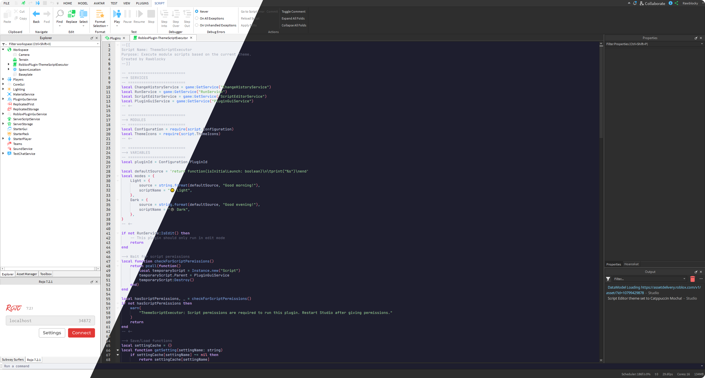

**Roblox Marketplace:** https://create.roblox.com/store/asset/85734022807898/Theme-Script-Executor

# Theme Script Executor

Executes a ModuleScript based on the current Roblox Studio theme. It'll run on startup and whenever the current studio theme changes. You can use this to run a script that'll change the current script editor theme.

## Example use case

	
	Having your script editor automatically change themes depending on Roblox Studio's current theme

	<a href="https://github.com/Rawblocky/RobloxPlugin-ThemeScriptExecutor/blob/main/SampleScripts/CatppuccinThemes/README.md">More info</a>

# Building

To build the plugin, make sure you have [Visual Studio Code](https://code.visualstudio.com) installed with the folder in this repository opened as the workspace.

You will also need the [Rojo](https://marketplace.visualstudio.com/items?itemName=evaera.vscode-rojo) extension installed and enabled.

From there you can press `Ctrl + Shift + B` inside of Visual Studio Code and the plugin should be deployed to Roblox Studio's Plugins folder!

# Credits

Plugin written by Rawblocky

Used [MaximumADHD's Roblox-Plugins](https://github.com/MaximumADHD/Roblox-Plugins)'s repository as a reference for how this repository is structured and the file needed to build this plugin
